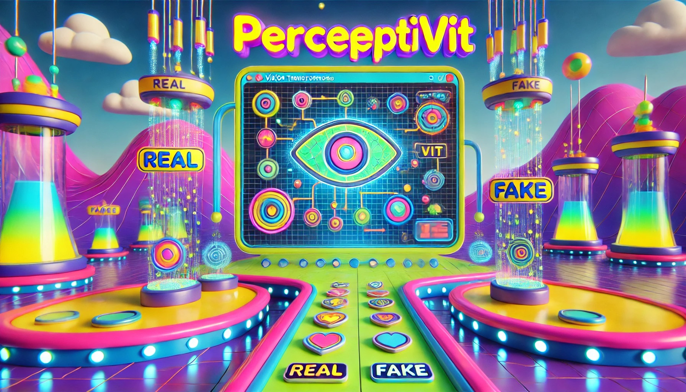
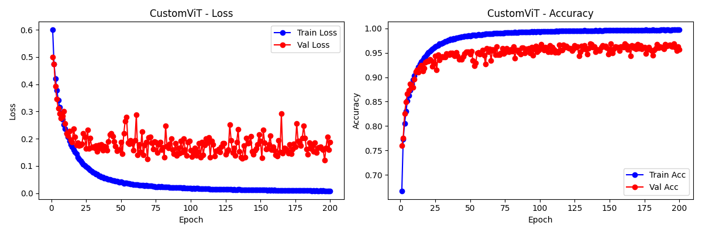
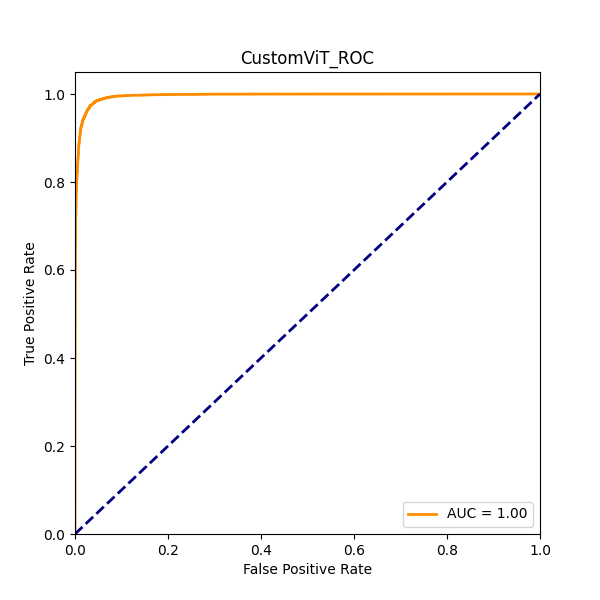
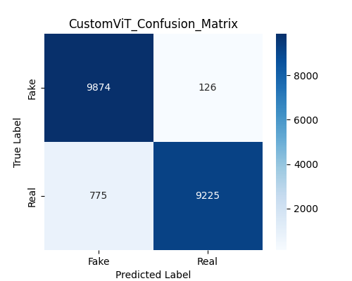

# PerceptiVIT: Real vs. Fake Image Classification

This repository contains the implementation of a Vision Transformer (ViT)-based image classification model for detecting real vs. fake images. The project includes custom datasets, a Vision Transformer architecture, training pipelines, and a Streamlit-based web application for inference.

---



---

## Table of Contents

1. [Project Overview](#project-overview)
2. [Features](#features)
3. [Installation](#installation)
4. [Usage](#usage)
5. [Directory Structure](#directory-structure)
6. [How It Works](#how-it-works)
7. [Results](#results)
8. [Future Improvements](#future-improvements)
9. [Contributors](#contributors)

---

## Project Overview

**PerceptiVIT** is a lightweight image classification pipeline leveraging the Vision Transformer (ViT) architecture to classify images as either `Real` or `Fake`. It includes:

- A custom dataset handler for efficient image loading.
- A Vision Transformer implementation with reduced parameters for quick prototyping.
- Training and validation pipelines for efficient experimentation.
- A Streamlit web application for user-friendly inference.

---

## Features

- **Custom Dataset Handling**: Efficient data loading with support for transformations and batching.
- **Vision Transformer**: Lightweight implementation optimized for speed and accuracy.
- **Training and Validation**: Easy-to-use pipelines with real-time metrics logging.
- **Streamlit Web App**: Simple interface for inference with uploaded images.
- **Visualizations**: ROC curve, confusion matrix, and training/validation loss and accuracy plots.

---

## Installation

1. Clone the repository:
   ```bash
   git clone https://github.com/ParamChordiya/PerceptiVIT.git
   cd perceptivit
   ```

2. Create a virtual environment:
   ```bash
   python -m venv venv
   source venv/bin/activate  # On Windows: venv\Scripts\activate
   ```

3. Install dependencies:
   ```bash
   pip install -r requirements.txt
   ```

4. Install Streamlit for the web application:
   ```bash
   pip install streamlit
   ```

---

## Usage

### Training

1. Prepare your datasets and update the CSV paths in `src/train_vit.py`.
2. Train the model:
   ```bash
   python src/train_vit.py
   ```

### Inference

1. Start the Streamlit web app:
   ```bash
   streamlit run app.py
   ```
2. Upload an image to classify it as `Real` or `Fake`.

---

## Directory Structure

```
perceptivit/
├── data/                # Dataset CSV files
├── plots/               # Training and validation plots
├── src/                 # Source code
│   ├── datasets.py      # Dataset handling
│   ├── model_vit.py     # Vision Transformer implementation
│   └── train_vit.py     # Training and validation pipeline
├── app.py               # Streamlit application
├── requirements.txt     # Python dependencies
└── README.md            # Project documentation
```

---

## How It Works

1. **Dataset Handling**:
   - CSV files specify image paths and labels.
   - Transformations include resizing, normalization, and data augmentation.

2. **Vision Transformer Architecture**:
   - Images are split into patches.
   - Patch embeddings are passed through transformer blocks.
   - Classification token aggregates global information.

3. **Training Pipeline**:
   - Loss: CrossEntropyLoss.
   - Optimizer: AdamW.
   - Metrics: Accuracy, Confusion Matrix, and ROC-AUC.

4. **Inference**:
   - Images are preprocessed and passed through the trained model.
   - Predictions and confidence scores are displayed.

---

## Results

- **Model Accuracy**:
  - Training: ~99%
  - Validation: ~96%

- **Test Performance**:
  - Loss: 0.1999
  - Accuracy: 95.49%

- **Visualizations**:
  - Loss and Accuracy:

   

  - ROC Curve:

    

  - Confusion Matrix:

    

---

## Future Improvements

- Add support for additional datasets and labels.
- Optimize the model for deployment on edge devices.
- Try random things

---

## Contributors

- [Param Chordiya](https://github.com/paramchordiya)

---

## Dataset Used

- [140k Real and Fake Faces](https://www.kaggle.com/datasets/xhlulu/140k-real-and-fake-faces)

---

Thank you for using **PerceptiVIT**! Feel free to contribute or raise issues for improvements.
